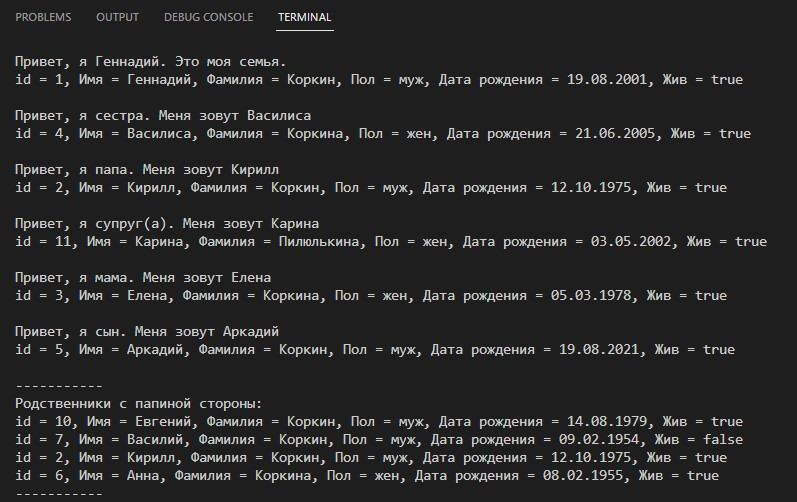
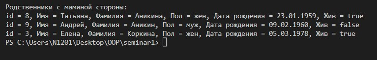

# Семейное дерево

- Класс Man - базовый класс, человек обыкновенный. У человека есть: id, имя, дата рождения, пол и информация, жив ли он на данный момент;
- Класс Person - наследуется от класса Men. Здесь добавлются id родственников
- Все остальные классы наследуются от Person. Это: Mother, Father, Daughter, Partner, Son, Sister, Brother;
Их отличие - фирменное приветствие в методе Hello.
- 1) В mainTree.java создаем 11 персон, добавляем их в HashSet 
    2) Определяем кто кем приходится персоне с id 1. Т.е создаем древо для конкретной персоны посредством метода getTree. 
    3) Распечатываем приветствие и данные человека.
    4) Проводим исследование - находим и печатаем всех родственников со строны отца, а затем матери для хозяина полученного древа с помощью метода getBranch

Пример работы кода: 

